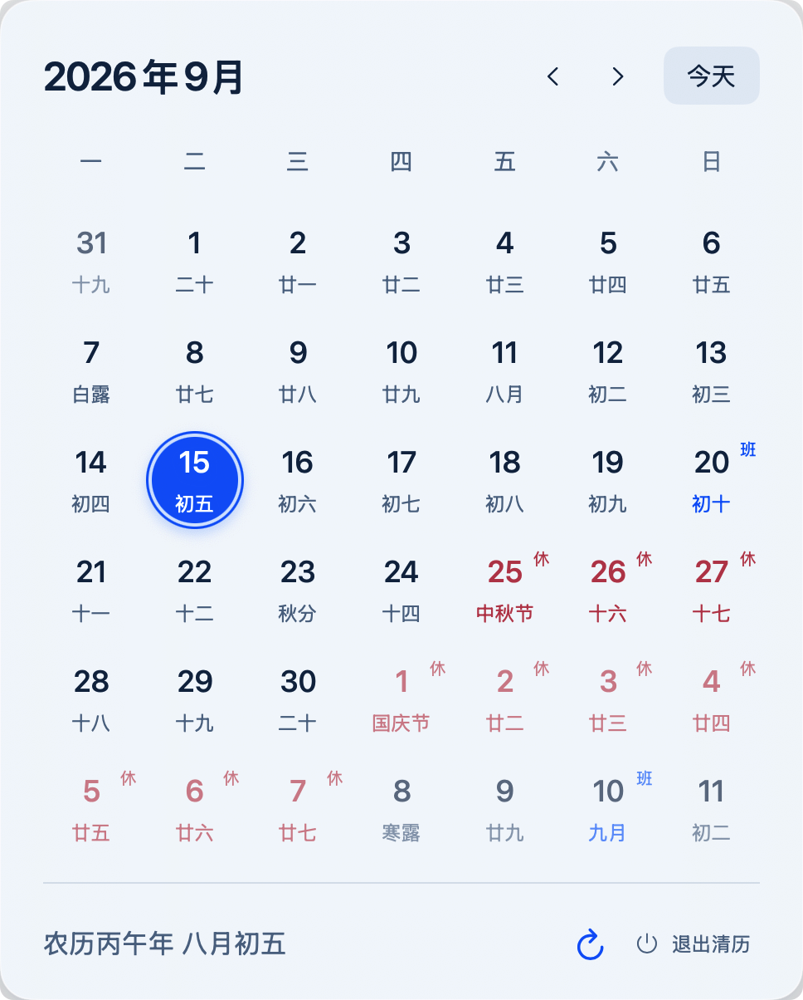

# 清历

清历是一款 macOS 14+ 菜单栏农历应用，把公历、农历、传统节日、二十四节气和中国法定放假、调休补班信息放在手边。应用不读取系统日历，也不显示 Dock 图标。

<p align="center">
  
</p>

## 功能

- 菜单栏快速打开月历，支持浅色与深色外观
- 查看农历、传统节日、二十四节气及法定休班安排
- 点击月份标题快速选择年月，支持 `1900-01-31` 至 `2100-12-31`
- 使用方向键移动日期，按 `⌘T` 回到今天
- 提供小号和大号桌面小组件
- 内置 2025、2026 年国务院放假与调休补班安排，并支持手动检查后续年份

## 下载与安装

[前往 GitHub Releases 下载最新版本](../../releases/latest)。

1. 解压下载的文件。
2. 将 `清历.app` 移到 `/Applications` 或当前用户的 `Applications` 目录。
3. 启动清历；需要小组件时，再从系统小组件面板添加“清历”。

请勿从临时解压目录运行应用。发布包如果尚未完成 Developer ID 签名和公证，macOS 可能提示无法验证开发者；请只从本仓库 Releases 获取构建，并保留系统安全检查。

## 从源码运行

### 环境要求

- macOS 14 或更高版本
- Xcode 26.3 或更高版本
- Swift 6
- [XcodeGen](https://github.com/yonaskolb/XcodeGen)（仅修改 target 或签名配置并重新生成工程时需要）

使用 Xcode 打开 `QingLi.xcodeproj`，选择 `QingLi` scheme 后运行。首次使用节假日共享更新功能前，需要在 Signing & Capabilities 中为 App 和 Widget 选择当前登录的开发团队。

工程默认使用 Bundle ID `com.qingli.app`、Widget Bundle ID `com.qingli.app.widget` 和 App Group `group.com.qingli.app`。如果这些标识无法注册到你的团队，请在 `project.yml`、两个 entitlements 文件以及 App/Widget 中的 App Group 常量里统一替换为自己的唯一标识，然后重新生成工程：

```sh
xcodegen generate --spec project.yml
```

## 节假日数据与隐私

内置数据位于 `Sources/QingLiCore/Resources/holidays.json`，覆盖国务院通知所列的 2025、2026 年放假日与调休补班日；普通周末不在这份数据中。

应用不会读取系统日历。只有在你点击“节假日更新”，并在“数据更新”窗口选择“检查节假日日历更新”后，应用才会访问固定的 [iCloud 中国大陆节假日日历](https://calendars.icloud.com/holidays/cn_zh.ics)。应用会解析下一缺失年份并展示预览；确认后，完整数据集保存到 App Group，并同步刷新小组件。取消操作、下载失败或数据校验失败都不会覆盖现有数据。

## 技术与依赖

- SwiftUI、AppKit、WidgetKit
- Swift Package Manager
- [LunarCore-Swift 1.2.0](https://github.com/wbx1-Ltd/LunarCore-Swift) 提供农历与节气计算
- XcodeGen 管理工程定义

## 验证

```sh
swift test
xcodebuild -project QingLi.xcodeproj -scheme QingLi -configuration Debug build CODE_SIGNING_ALLOWED=NO
```

## 许可证

本项目采用 [MIT License](LICENSE)。
